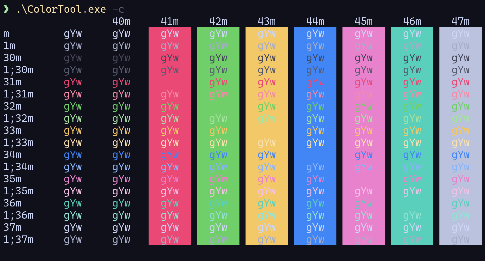
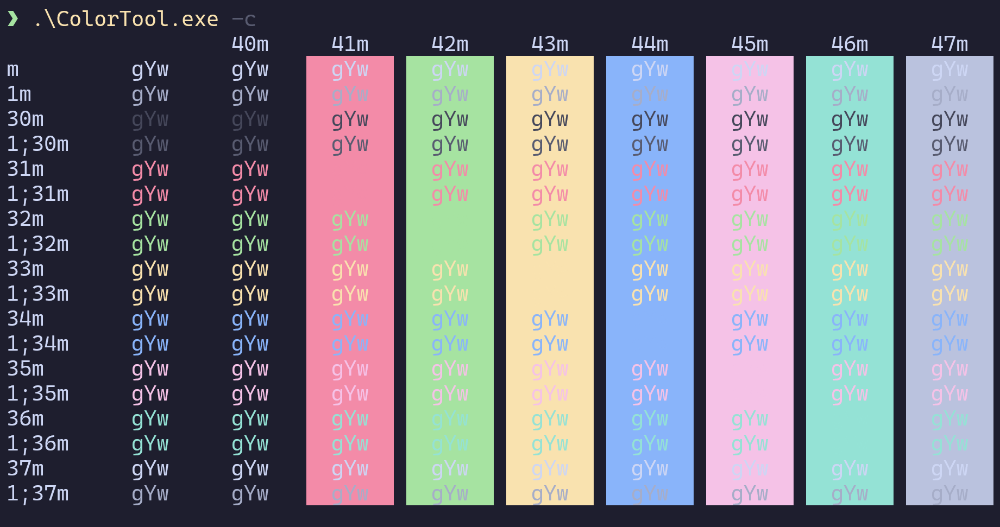
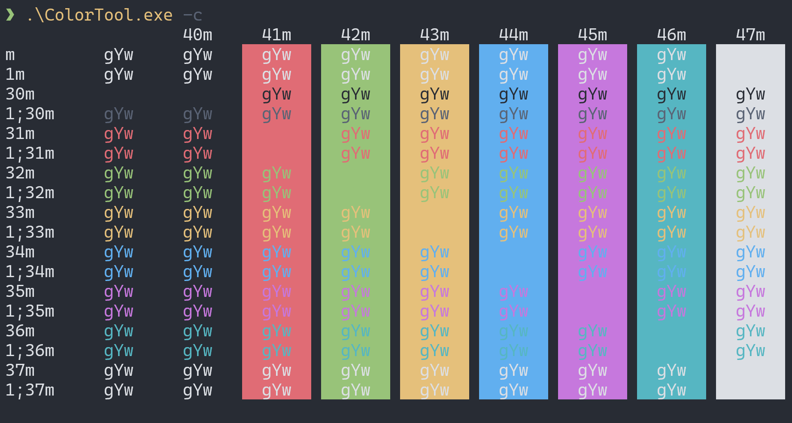
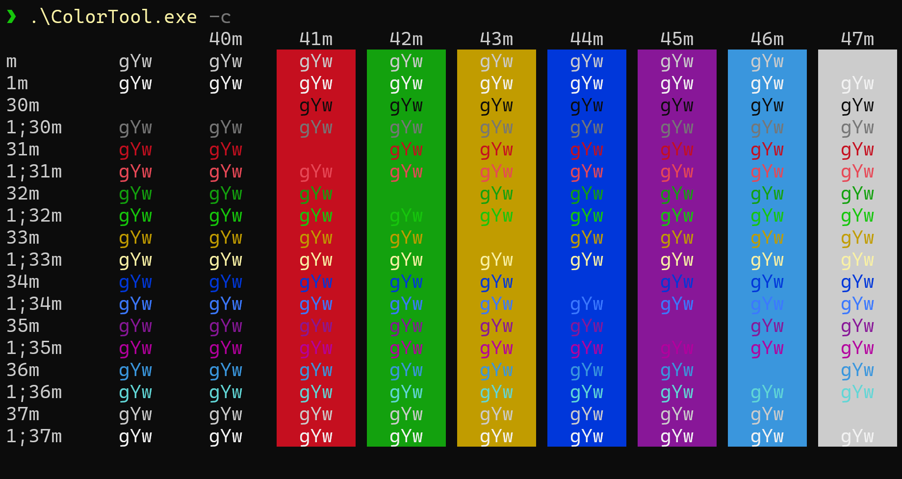

# Catppuccin 生椰拿铁

一个受 [Catppuccin](https://github.com/catppuccin/catppuccin) 启发、可读性更强的终端配色方案。



[English](README.md) | **简体中文**

## 使用方法

1. 打开 Windows Terminal。
2. 进入设置面板。
3. 点击左下角的“打开 JSON 文件”。
4. 将以下内容添加到 `"schemes"` 数组中：

```json
{
  "name": "Coconut Latte",

  "cursorColor": "#F5E0DC",
  "selectionBackground": "#4F5160",

  "background": "#10101A",
  "foreground": "#CDD6F4",

  "black": "#45475A",
  "red": "#EA4875",
  "green": "#70CF68",
  "yellow": "#F2C869",
  "blue": "#4286F5",
  "purple": "#E982CC",
  "cyan": "#5AD0BC",
  "white": "#BAC2DE",
  
  "brightBlack": "#585B70",
  "brightRed": "#F38BA8",
  "brightGreen": "#A6E3A1",
  "brightYellow": "#F9E2AF",
  "brightBlue": "#89B4FA",
  "brightPurple": "#F5C2E7",
  "brightCyan": "#94E2D5",
  "brightWhite": "#A6ADC8"
}
```

ANSI 颜色：

```json
{
  "0": "#45475A",   // 黑色
  "1": "#EA4875",   // 红色
  "2": "#70CF68",   // 绿色
  "3": "#F2C869",   // 黄色
  "4": "#4286F5",   // 蓝色
  "5": "#E982CC",   // 紫色
  "6": "#5AD0BC",   // 青色
  "7": "#BAC2DE",   // 白色

  "8":  "#585B70",  // 亮黑
  "9":  "#F38BA8",  // 亮红
  "10": "#A6E3A1",  // 亮绿
  "11": "#F9E2AF",  // 亮黄
  "12": "#89B4FA",  // 亮蓝
  "13": "#F5C2E7",  // 亮紫
  "14": "#94E2D5",  // 亮青
  "15": "#A6ADC8"   // 亮白
}
```

## 对比

**Coconut Latte：**


**Catppuccin Mocha：**



**One Half Dark：**


**Campbell：**


## 设计动机

1. 相比于默认的 Campbell 等主题，Catppuccin 更注重颜色感知亮度的一致性，使配色更均匀、不刺眼。
2. Catppuccin 未对 ANSI 亮色做区分，本主题针对亮色做了微调，增强了背景色与白色字体的对比度。
3. 略微降低了背景和选中背景的亮度与饱和度，从而更突出前景文字。
