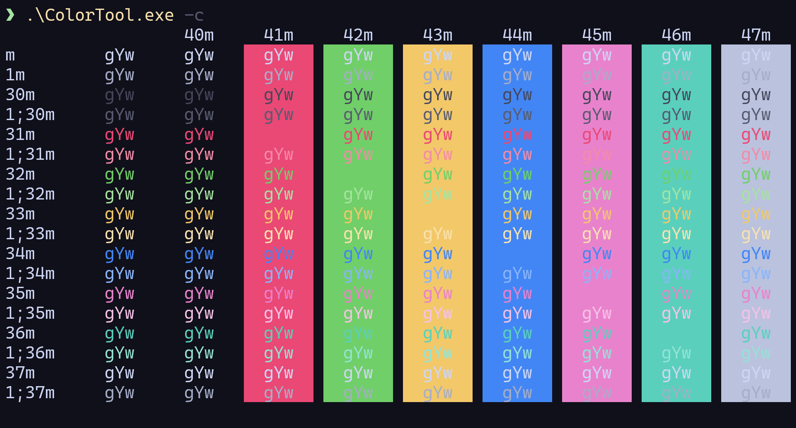
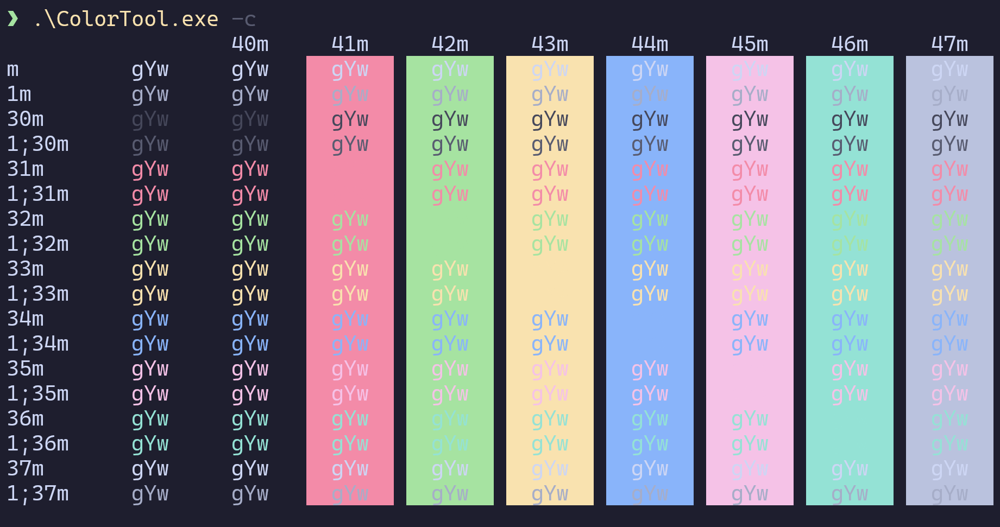
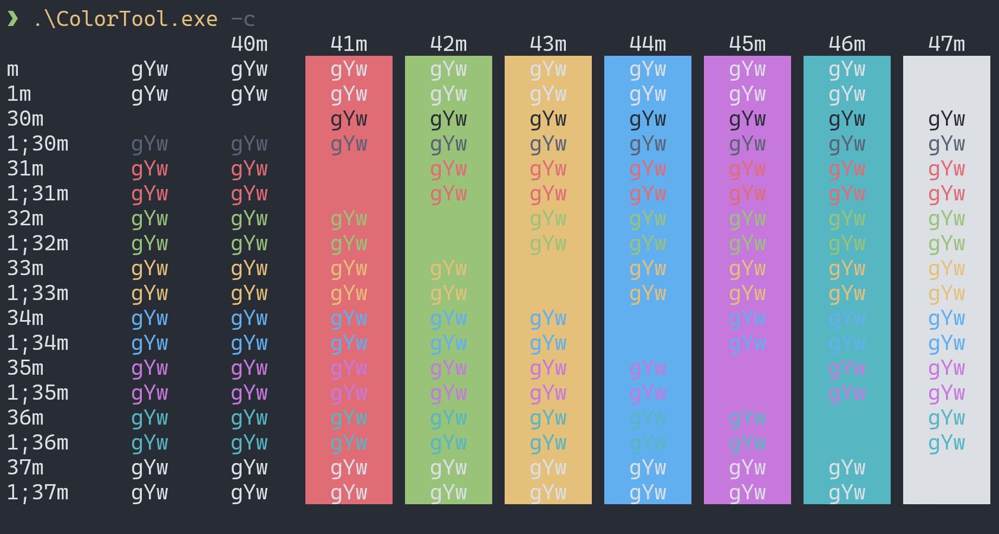
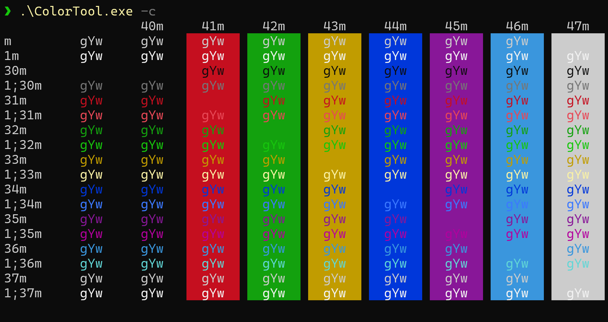

# Catppuccin Coconut Latte Color Scheme

A terminal color scheme inspired by [Catppuccin](https://github.com/catppuccin/catppuccin), with better readability.



## Usage

1. Launch Windows Terminal.
2. Open the Settings panel.
3. Click "Open JSON file" at the bottom left corner.
4. Paste the following content into the `"schemes"` array:

```json
{
  "name": "Coconut Latte",

  "cursorColor": "#F5E0DC",
  "selectionBackground": "#4F5160",

  "background": "#10101A",
  "foreground": "#CDD6F4",

  "black": "#45475A",
  "red": "#EA4875",
  "green": "#70CF68",
  "yellow": "#F2C869",
  "blue": "#4286F5",
  "purple": "#E982CC",
  "cyan": "#5AD0BC",
  "white": "#BAC2DE",
  
  "brightBlack": "#585B70",
  "brightRed": "#F38BA8",
  "brightGreen": "#A6E3A1",
  "brightYellow": "#F9E2AF",
  "brightBlue": "#89B4FA",
  "brightPurple": "#F5C2E7",
  "brightCyan": "#94E2D5",
  "brightWhite": "#A6ADC8"
}
```

ANSI colors:

```json
{
  "0": "#45475A",   // black
  "1": "#EA4875",   // red
  "2": "#70CF68",   // green
  "3": "#F2C869",   // yellow
  "4": "#4286F5",   // blue
  "5": "#E982CC",   // purple
  "6": "#5AD0BC",   // cyan
  "7": "#BAC2DE",   // white

  "8":  "#585B70",  // brightBlack
  "9":  "#F38BA8",  // brightRed
  "10": "#A6E3A1",  // brightGreen
  "11": "#F9E2AF",  // brightYellow
  "12": "#89B4FA",  // brightBlue
  "13": "#F5C2E7",  // brightPurple
  "14": "#94E2D5",  // brightCyan
  "15": "#A6ADC8"   // brightWhite
}
```

## Comparison

**Coconut Latte:**


**Catppuccin Mocha:**



**One Half Dark:**


**Campbell:**


## Motivation

1. Compared to default themes like Campbell, Catppuccin carefully considers perceptual brightness consistency, resulting in more balanced and less harsh colors.
2. Catppuccin does not differentiate bright ANSI colors; this theme tweaks them for greater contrast between color backgrounds and white text.
3. The background and selection colors are slightly darkened and desaturated to better highlight foreground text
